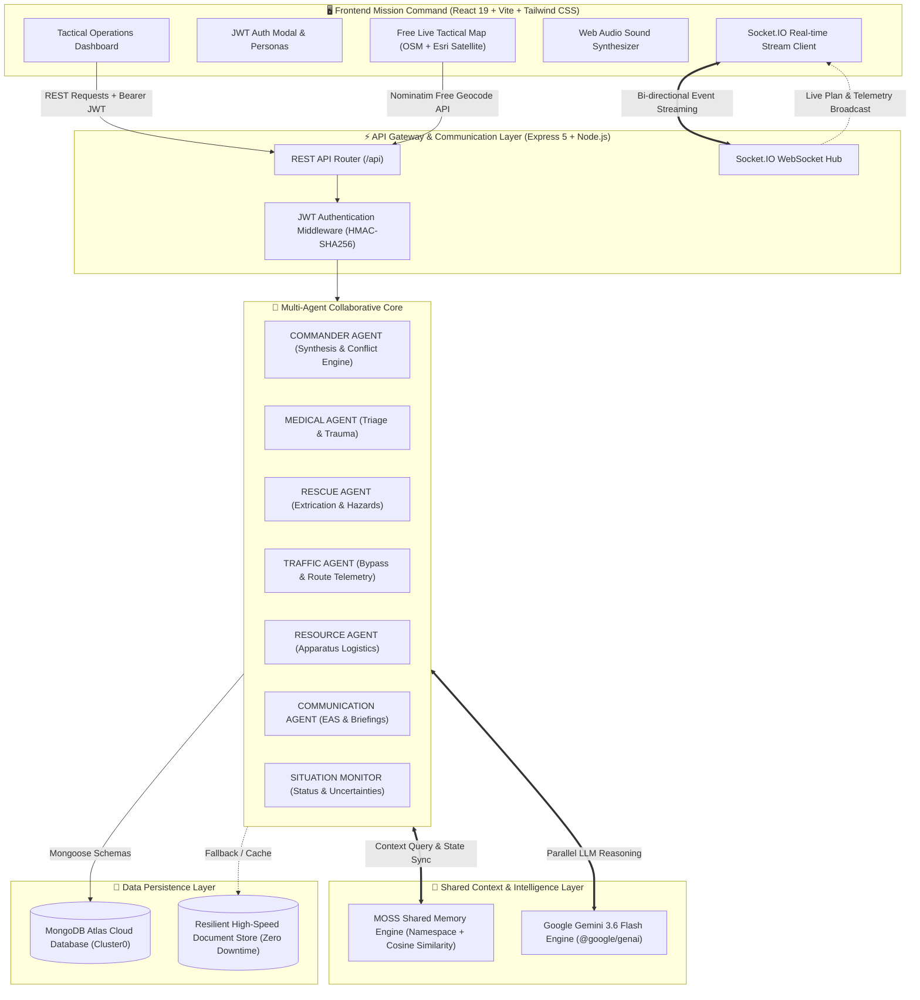
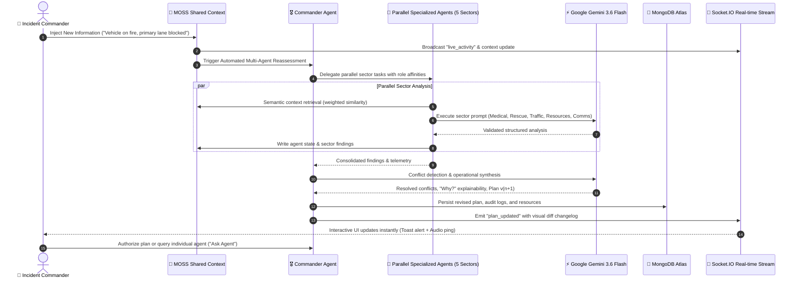
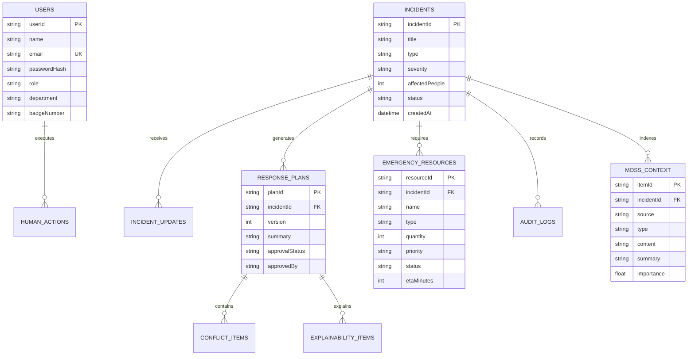

# 🚨 RESCUEGRID AI
### Collaborative Multi-Agent Emergency Response & Operational Coordination Platform

[](https://github.com/SiddharthK1257/RescueGrid-AI)
[](https://aistudio.google.com/)
[](https://www.mongodb.com/atlas)
[](https://jwt.io)
[](https://www.openstreetmap.org)
[](https://opensource.org/licenses/MIT)

> **"AI-powered mission workspaces where humans and specialized autonomous agents share operational context and collaborate on dynamic, life-critical emergency lifecycles."**

---

## 🌟 Executive Summary

**RescueGrid AI** transforms emergency incident management from an isolated, single-turn chatbot into an **authoritative multi-agent command centre**. During disaster and trauma events, seconds matter. Multiple specialized autonomous AI agents—**Commander, Medical, Rescue, Traffic & Route, Resource, Communication, and Situation Monitor**—collaborate continuously with human incident commanders over long-running incident lifecycles.

Instead of treating emergency response as a single generic prompt:
```
OLD WAY: HUMAN OPERATOR ──> CHATBOT ──> GENERIC, ISOLATED ANSWER
```

**RescueGrid AI** powers an active, stateful multi-agent swarm synchronized through **MOSS Shared Semantic Memory**, powered by **Google Gemini 3.6 Flash**, backed by **real MongoDB Atlas persistence**, secured with **JWT cryptographic authentication**, and visualized on an interactive **Free Live Map**:

---

## 🏛️ System Architecture Diagrams

### 1. High-Level System & Network Architecture



---

### 2. Multi-Agent Collaborative Feedback Loop (Sequential Workflow)



---

### 3. Database Entity-Relationship Architecture



---

## 🤖 The 7 Specialized Autonomous Agents

| Agent | Tactical Sector | Core Responsibilities & Safety Guardrails |
| :--- | :--- | :--- |
| **COMMANDER** | Strategic Command | Decomposes incidents, delegates tasks, detects inter-agent conflicts, resolves precedence, synthesizes unified Response Plans, and publishes change explanations (*Why?*). |
| **MEDICAL** | Triage & Healthcare | Categorizes casualties strictly by urgency (**CRITICAL, URGENT, NON-URGENT, UNKNOWN**). Guardrail: **Never diagnoses clinical conditions**; provides operational casualty coordination with mandatory disclaimers. |
| **RESCUE** | Physical Extrication | Evaluates physical hazards (entrapment, thermal runaway, smoke toxicity, structural collapse). Outputs rescue priorities, equipment specs, and safety corridors. |
| **TRAFFIC** | Route & Access | Monitors highway obstruction, lane constriction, and active road closures. Computes alternate emergency bypass corridors (e.g. Corridor Route 4B North Bypass). |
| **RESOURCE** | Logistics Demand | Calculates needed apparatus (ALS Ambulances, Fire Engines, Heavy Extrication, Police Units). Guardrail: Never claims an apparatus is physically on-scene without external dispatch confirmation. |
| **COMMUNICATION** | Alerts & Briefings | Synthesizes tactical responder briefings, Emergency Alert System (EAS) public broadcast warnings, and command center situational updates. |
| **SITUATION** | Situational Awareness | Evaluates live incident state (**REPORTED, ASSESSING, ACTIVE RESPONSE, ESCALATED, CONTAINED, RESOLVED**) and surfaces residual operational uncertainties. |

---

## ⚔️ Real-Time Conflict Detection & Resolution

During real emergencies, specialist agents frequently have competing priorities. **RescueGrid AI** solves this with automated conflict resolution:

```
┌────────────────────────────────────────────────────────────────────────────────────────┐
│ 🚨 CONFLICT DETECTED BY COMMANDER AGENT                                               │
├────────────────────────────────────────────────────────────────────────────────────────┤
│ • MEDICAL AGENT: Demands immediate, rapid highway access for critical trauma victims.  │
│ • TRAFFIC AGENT: Reports primary expressway is completely obstructed by collided cars. │
├────────────────────────────────────────────────────────────────────────────────────────┤
│ 💡 COMMANDER OPERATIONAL ANALYSIS:                                                     │
│ Routing ambulances into the primary blockage creates an 18-minute transit bottleneck.   │
│ Route clearance priority must supersede nominal distance preference.                   │
├────────────────────────────────────────────────────────────────────────────────────────┤
│ ✅ RESOLUTION & DIRECTIVE:                                                             │
│ Divert all incoming ALS Ambulances to Corridor Route 4B (North Bypass) under police    │
│ escort. Establish an on-scene Casualty Collection Point at Exit 14 Overpass.           │
└────────────────────────────────────────────────────────────────────────────────────────┘
```

---

## 🗺️ 100% Free Live Map Engine (Zero API Key)

The built-in Tactical Map ([`client/src/components/EmergencyMap.tsx`](client/src/components/EmergencyMap.tsx)) requires **zero paid map subscriptions**:

1. **4 Free Switchable Tile Layers**:
   - 🌑 **CartoDB Dark Matter**: High-contrast tactical mode for dark command rooms.
   - 🛰️ **Esri World Imagery**: Real high-resolution satellite aerial imagery.
   - 🗺️ **OpenStreetMap Standard**: Classical street and arterial navigation.
   - ⛰️ **OpenTopoMap**: Topographical elevation contours for search and rescue.
2. **OpenStreetMap Nominatim Free Geocoder**:
   - Interactive search bar to search any address, mile marker, or city globally with animated fly-to camera.
3. **Live Responder Fleet Telemetry**:
   - Real-time animated markers for ALS Ambulances, Fire Engines, Police Cruisers, and Heavy Rescue apparatus with live speed, ETA, and assignment popups.
4. **Visual Hazard Boundaries**:
   - Flashing roadblock barrier at Mile 44, glowing Route 4B detour corridor, pulsating incident epicenter, and 350m hazard perimeter.
5. **Browser HTML5 Geolocation**:
   - Instant "Locate Command Post" button with animated radar pulse.

---

## 🔒 Cryptographic JWT Authentication & Demo Personas

Built-in HMAC-SHA256 JWT authentication protects operational actions and assigns verified identities:

### 1-Click Operational Command Personas:
- 🛡️ **Chief Sarah Jenkins** — *Incident Commander* (`commander@rescuegrid.ai` / `Commander2026!`)
- 📡 **Marcus Vance** — *Senior Operations Dispatcher* (`dispatcher@rescuegrid.ai` / `Dispatch2026!`)
- 🚒 **Capt. Elena Rostova** — *Field Rescue Lead* (`fieldlead@rescuegrid.ai` / `Rescue2026!`)
- 🩺 **Dr. Aris Thorne** — *Medical Triage Director* (`medical@rescuegrid.ai` / `Medical2026!`)

Users can also register custom accounts with dedicated tactical roles (`COMMANDER_OPERATOR`, `DISPATCHER`, `FIELD_LEAD`, `OBSERVER`).

---

## 💻 Tech Stack & Tooling

| Domain | Technologies Used |
| :--- | :--- |
| **Frontend UI** | React 19, TypeScript, Tailwind CSS v4, Lucide Icons, Vite |
| **Mapping Engine** | Leaflet, OpenStreetMap, CartoDB, Esri World Imagery, OpenTopoMap, Nominatim API |
| **Backend Core** | Node.js, Express 5, TypeScript, tsx watch |
| **Real-time Comms** | Socket.IO (WebSocket push & incident room channels) |
| **AI Reasoning** | Google Gemini 3.6 Flash (`@google/genai` SDK) |
| **Shared Memory** | MOSS (Multi-Agent Operational Shared State Engine with TF-IDF Vector Cosine Retrieval) |
| **Database** | MongoDB Atlas (Mongoose 9 ODM) + Resilient In-Memory Fallback Cache |
| **Security** | JSON Web Tokens (`jsonwebtoken`), Password Hashing (`bcryptjs`) |
| **Audio Engine** | Web Audio API Synthesizer (Zero external audio files) |

---

## 🚀 Quick Start Guide

### Prerequisites
- **Node.js**: v18+ (tested on Node.js v24)
- **npm**: v9+

### 1. Clone the Repository
```bash
git clone https://github.com/SiddharthK1257/RescueGrid-AI.git
cd RescueGrid-AI
```

### 2. Install Dependencies
```bash
# Install root dependencies
npm install

# Install client dependencies
npm --prefix client install
```

### 3. Configure Environment
Create a `.env` file in the root directory (or copy `.env.example`):
```env
PORT=5000

# MongoDB Atlas Connection String
MONGODB_URI=mongodb+srv://<db_username>:<db_password>@cluster0.jmxqta5.mongodb.net/?appName=Cluster0
DB_USERNAME=admin

# Google Gemini API Key (Server-side only)
GEMINI_API_KEY=your_gemini_api_key_here

# JWT Secret
JWT_SECRET=rescuegrid-jwt-secret-key-3f98a2e1d054bc-2026

# MOSS Shared Memory
MOSS_ENDPOINT=http://localhost:5000/api/moss/local
```
*(Note: You can also configure your Gemini API Key and MongoDB Atlas credentials dynamically in the web UI via the Settings modal!)*

### 4. Run Development Servers
```bash
npm run dev
```
- **Web App (Vite Dev Server)**: [http://localhost:5173](http://localhost:5173)
- **Backend API & Socket.IO**: [http://localhost:5000](http://localhost:5000)

### 5. Production Build & Execution
```bash
npm run build
npm start
```
Open **[http://localhost:5000](http://localhost:5000)** to view the production build.

---

## 🏆 Hackathon Step-by-Step Demonstration Walkthrough

1. **Launch Platform**: Open the dashboard at [http://localhost:5000](http://localhost:5000). The Flagship Scenario (`RG-2026-0001` Highway Multi-Vehicle Collision) auto-initializes.
2. **Observe Multi-Agent Pipeline**: View the 7 specialized agents analyzing trauma, routes, hazards, and logistics in parallel.
3. **Inspect MOSS Context**: Switch to the **SHARED CONTEXT** tab to inspect role-affinity weighted memory items.
4. **Interactive Tactical Map**: Switch to **INCIDENT MAP**. Toggle between Dark Tactical, Satellite Aerial, and Topographical layers. Try the free OpenStreetMap address search bar.
5. **Simulate Disaster Evolution (Step 9)**: Click `+ INJECT UPDATE` and submit:
   > *"Fire is now reported in one vehicle and the primary access lane is blocked."*
6. **Watch Real-Time Reassessment**:
   - Rescue Agent immediately escalates fire hazard to **CRITICAL**.
   - Traffic Agent marks the primary highway **HARD CLOSED** and activates Corridor 4B Bypass.
   - Commander Agent resolves the thermal vs extrication conflict and publishes **Response Plan v2**.
7. **Inspect Explainability ("Why?")**: Click any recommendation to view the exact MOSS context items, uncertainty score, and decision rationale.
8. **Approve Directives**: Click `APPROVE PLAN` as Incident Commander to authorize actions.

---

## 📄 License
This project is open-source under the **MIT License**. Built for the **Multiplayer AI & Collaborative Agents Hackathon**.
